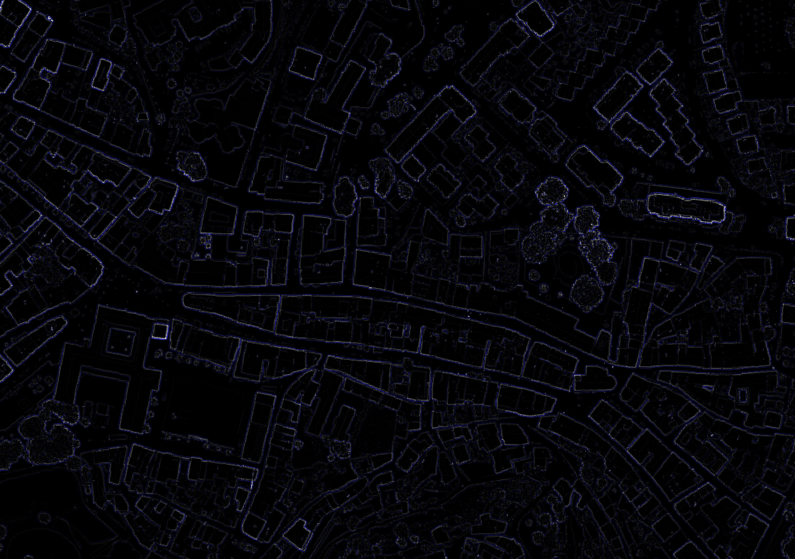

# LiDAR Portugal

This repository contains a map tile server for LiDAR data in Portugal.


City center of Bragança, Portugal, rendered with the anomaly metric.

The data can be sourced from [Direção-Geral do Território (DGT)](https://www.dgterritorio.gov.pt/), which provides high-resolution LiDAR data for the entire country (see [datasets](https://cdd.dgterritorio.gov.pt/dgt-fe/catalogos/colecoes?filter=LiDAR+-+Modelos+Digitais+do+Relevo&language=en)). I used the `MDS-50cm` dataset, corresponding to a digital surface model (includes buildings) with a resolution of 50 cm.

The map tile server follows the TMS format, allowing users to access and visualize this data in a web application. I implemented the server with the purpose of adding it as an image layer to JOSM.

## How to use

### Data preparation

You must first download the data you want to visualize. I picked the district of Bragança, and downloaded all the `MSD-50cm` data tiles for the district (98.4 GB) to folder `data`, such that the LiDAR TIFF tiles are in `data/MDS-50cm`.

To download the TIFF tiles I used the QGIS plugin [DGT CDD Downloader](https://plugins.qgis.org/plugins/dgt_cdd_downloader/), you can provide it with your DGT credentials, a polygon defining your area of interest and the dataset you want to download, and it will download all the tiles that are inside the polygon. This is a lot easier than downloading the tiles from the DGT website, which only allows to explore 200 tiles at a time, so you can only add 200 tiles at a time to your cart and then download them.

The QGIS plugin:
- divides the area of interest into smaller chunks and downloads the tiles one at a time, so you can even leave it running;
- only downloads tiles that have not yet been downloaded, so it's also good to use if for some reason your connection drops while you're downloading a large amount of tiles.

Just beware, if you select a large area, it may fill up your disk, and may take a while to download (from experience, 2-4h to download the district of Bragança, 98.4 GB; your case may depend on your bandwidth, and if you want to be extra cheeky you can launch multiple instances of the QGIS plugin to download simultaneously, tho for me it wasn't worth it).

### Server

Spin up the server:

```bash
make serve
```

Then you can test the server by opening a browser and entering an URL like `http://localhost:8080/tiles/<zoom>/<x>/<y>`. The `zoom`, `x` and `y` parameters vary based on what data you downloaded. This endpoint follows the TMS format.

To add it to JOSM, insert a new image layer with definition:
```
tms[16,19]:http://localhost:8080/tiles/{zoom}/{x}/{-y}
```

The server only returns tiles for zoom levels 16 to 19:
- The resolution at level 18 at the latitude of Portugal (~0.46m) roughly corresponds to the original resolution of the data, so zoom levels under 18 are basically upsampled versions of the original data.
- I decided to limit the zoom level to 16 because when a tile is requested (that is not yet cached), I use gdal to generate a TIFF tile corresponding to the requested tile, but if the requested area is too big the resulting intermediate TIFF takes a long time to generate (although it will still not be too big, it will be approximately 256x256 pixels). With the above image layer definition for JOSM, it already knows it must not request zoom levels under 16, but it will still work because it will fetch as many tiles as needed at zoom level 16 to fill in the whole viewport.

## Features

- Custom metrics for rendering: I implemented an anomaly metric, which is the difference between the center pixel and the surrounding pixels in a 5x5 window.
- Custom rendering styles; the current style is black for anomaly=0m, white for anomaly=+12m and blue for anomaly=-10m.
- No temporary files: the intermediate TIFF tiles generated with gdal are not saved to disk, but instead are kept in memory for better performance and less disk usage.
- Tile caching: tiles are saved to `tiles/<zoom>/<x>/<y>.png`.

My original purpose was to find power poles using LiDAR data, so that's why I picked an anomaly metric. For general-purpose mapping, hillshade is a more common rendering, but it didn't fit my purpose because it didn't easily allow me to see large elevation changes compared to small elevation changes, since similar near-vertical hillshade angles can be generated by very different elevation differences (for instance, elevation differences of 5m or 10m in a 50 cm resolution dataset are rendered almost the same with hillshade because the angle in both is a bit less than 90°).

## Dependencies

- [gdal](https://gdal.org/): a geospatial data processing library.
    - I used gdal to generate a `.vrt` file with all the original LiDAR data tiles (formatted as TIFF), correct the projection to Web Mercator (EPSG:3857) and extract data from the `.vrt` file to generate the map tiles.
- [lvandeve/lodepng](https://github.com/lvandeve/lodepng): a PNG encoder/decoder library.
    - Used to generate PNG tiles from the extracted data.
- [yhirose/cpp-httplib](https://github.com/yhirose/cpp-httplib): a C++ header-only HTTP library.
    - Used to implement the HTTP server that serves the map tiles.
